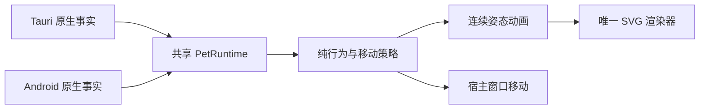

# SVG 桌宠 0.2.0

版本 03 的角色 rig 原样放在 `frontend/src/pet/pig.svg`。这次重构保留了认可的轮廓、圆头腿根、近侧前腿向后/后腿向前的睡姿，以及远侧腿被身体自然遮挡的绘制顺序。没有把演示页的布局带入桌宠。

| 层 | 文件 | 责任 |
| --- | --- | --- |
| 纯行为 | `pet/behavior.ts` | 七个状态、意图、随机漫游、位置边界、转向、音乐、拖拽与落地；随机源可注入 |
| 连续动画 | `pet/motion.ts` | 从当前姿态和速度接续睡眠/唤醒，混合走路/跳舞/拖拽，落地轻弹和减少动态 |
| SVG 渲染 | `pet/renderer.ts` | 唯一的 SVG transform、路径和颜色写入者；使用 03 的关节曲线及腹部形变 |
| 运行时 | `pet/runtime.ts` | 单一 rAF 时钟，30fps 绘制上限、暂停、隐藏/恢复、错误停机与释放 |
| 桌面宿主 | `hosts/tauri.ts`、`src-tauri/src/lib.rs`、`anchor.rs` | 原生拖拽、工作区/DPI、窗口移动、托盘、Windows 音乐状态和窗口顶部落点 |
| Android 宿主 | `hosts/android.ts`、`OverlayController.kt` | 悬浮窗权限/资源、触摸事件、窗口位置、音乐与屏幕/配置事件 |
| 开发宿主 | `hosts/browser.ts` | 在浏览器中测试同一套行为、动画和渲染代码 |



原生层不再维护第二套行为状态机，也不再向渲染器发送动画帧或 clip 名字。Rust JNI PetEngine 和 Kotlin 的重复漫游/移动定时器已移除。用户原有未提交版本仍保留在原 checkout，以及本任务交接目录的备份中。

意图在拖拽期间会排队，松开后应用。系统音乐在拖拽时仅更新事实，避免覆盖 Dragged；音乐停止后也不会恢复旧的自动跳舞意图。睡眠/唤醒依靠共享计时器推进，不存在旧动画完成回调晚到而覆盖新状态的问题。暂停停止时钟并清除待发送移动；切换动作或开始拖拽会恢复。

显示尺寸统一使用逻辑像素（Android 为 dp），窗口坐标和边界使用物理像素，`scaleFactor` 明确连接两者。SVG 会跟随窗口尺寸缩放；速度跟随窗口物理尺寸换算，保持不同 DPR 下的逻辑移动速度。Windows 移动队列最多一个请求在途，并合并后续帧；进入原生拖拽前先排空旧请求。

Android 的 `pet.js` / `pet.css` 和入口 HTML 从共享源码自动构建。`bun run build` 同时生成桌面资源及悬浮窗 IIFE，后者通过普通 script 标签加载，避免 file URL 下的 ES 模块 CORS 问题。直接 Gradle 构建的 preBuild 也调用这条构建流程。旧六张 Android 精灵表不再打包。Apache LICENSE 和角色 NOTICE 随两端资源一起打包。

隐藏悬浮窗时，移除音频监听、屏幕 receiver 和配置回调，取消待发送移动，注销 bridge 并销毁 WebView。每个桥接实例带有创建代号，旧 WebView 回调无法移动新浮窗。屏幕关闭和页面隐藏会停止时钟；恢复时重置 delta，避免积累离线时间后突然跳跃。

运行入口和控件：桌面托盘支持待机、散步、跳舞、睡觉、唤醒、暂停和尺寸；键盘支持 S/D/P/Escape。Android 启动页保留权限、显示/隐藏控制，增加睡眠、暂停和动作控制；浮窗可拖动，双击切换睡眠。开发页控件只出现在普通浏览器宿主中。

构建使用 Bun 1.3.14，`bun.lock` 锁定依赖，`bunfig.toml` 的 `[run].bun = true` 让 CLI 默认使用 Bun 运行：

```powershell
bun install --frozen-lockfile
bun run lint
bun run test
bun run build
bun run tauri build --debug --no-bundle
```

Android 使用已有 JDK、SDK 和 NDK：

```powershell
bun run tauri android build --debug --target aarch64 x86_64 --apk --ci
```

版本号在 package.json、Cargo.toml 和 Tauri 配置中统一为 0.2.0。Android 版本信息由 Tauri 生成（versionCode 2000）。本版本仍需按验收记录完成真机和原生交互检查，尚未正式发布或部署。
